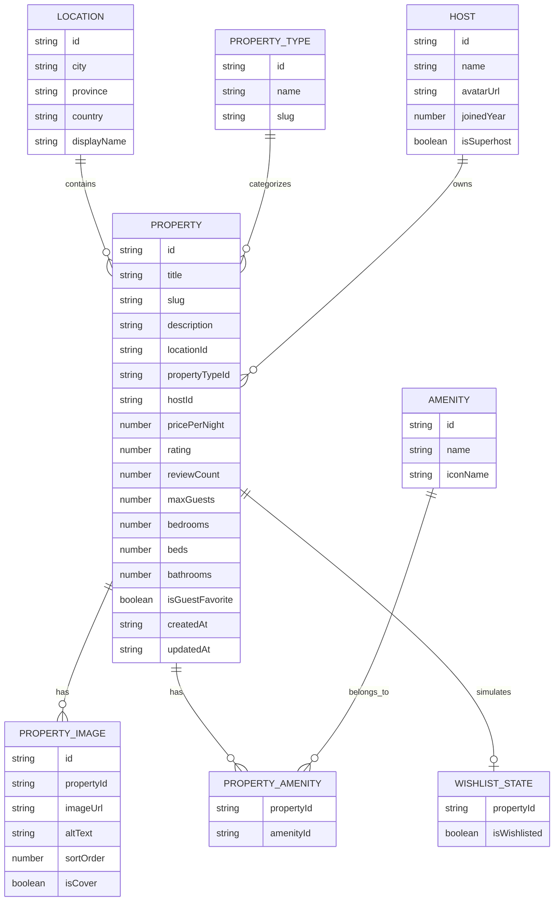

# ERD Backend Listing Properti

## Tujuan ERD

Entity Relationship Diagram dirancang untuk memodelkan domain listing properti Airbnb-like. Model ini mendukung kebutuhan listing page, detail page, search, filter, sorting, pagination, dan interaksi wishlist simulasi pada frontend.

ERD ini menjadi dasar schema PostgreSQL yang didefinisikan dengan Drizzle ORM pada package `packages/db`. Nama entity pada dokumen ini merepresentasikan tabel utama yang akan di-query oleh backend Elysia melalui repository layer.

## Entity

### Property

Property mewakili data utama properti yang ditampilkan pada listing dan detail page.

Field minimal:

- id
- title
- slug
- description
- locationId
- propertyTypeId
- hostId
- pricePerNight
- rating
- reviewCount
- maxGuests
- bedrooms
- beds
- bathrooms
- isGuestFavorite
- createdAt
- updatedAt

### Location

Location mewakili lokasi properti.

Field minimal:

- id
- city
- province
- country
- displayName

### PropertyType

PropertyType mewakili kategori atau tipe properti.

Field minimal:

- id
- name
- slug

Contoh tipe properti:

- Villa
- Apartment
- House
- Cabin
- Guesthouse

### Host

Host mewakili pemilik atau pengelola properti.

Field minimal:

- id
- name
- avatarUrl
- joinedYear
- isSuperhost

### Amenity

Amenity mewakili fasilitas yang tersedia pada properti.

Field minimal:

- id
- name
- iconName

### PropertyAmenity

PropertyAmenity merupakan pivot table untuk relasi many-to-many antara Property dan Amenity.

Field minimal:

- propertyId
- amenityId

### PropertyImage

PropertyImage mewakili gambar properti.

Field minimal:

- id
- propertyId
- imageUrl
- altText
- sortOrder
- isCover

### WishlistState

WishlistState digunakan untuk mendukung kebutuhan interaksi UI pada card listing dan halaman detail. Karena backend tidak memiliki authentication pada tahap awal, wishlist hanya bersifat simulasi dan tidak merepresentasikan fitur user account permanen.

Field minimal:

- propertyId
- isWishlisted

Untuk prototipe, state yang diubah pengguna dikelola secara lokal pada frontend. Data `WishlistState` atau tabel `wishlistStates` dapat digunakan untuk menyediakan nilai awal yang konsisten, tetapi tidak menjadi sumber penyimpanan permanen dan tidak memerlukan endpoint mutasi wishlist.

Aturan wishlist dummy:

- `isWishlisted` dikembalikan pada `PropertyListItem` dan `PropertyDetail`.
- Tombol wishlist melakukan toggle dari `false` ke `true`, atau dari `true` ke `false`.
- Listing dan detail pada frontend yang sama harus membaca state lokal yang sama selama sesi aplikasi aktif.
- State tidak dijamin bertahan setelah refresh, logout, penghapusan storage, atau perpindahan ke frontend penelitian lainnya.
- Authentication, `userId`, daftar wishlist pengguna, dan sinkronisasi lintas perangkat tidak dimodelkan pada tahap prototipe.

## Perilaku Load More pada Listing

`Load more` bukan entity database dan tidak memerlukan tabel tambahan. Fitur ini merupakan pola tampilan frontend yang menggunakan metadata pagination dari endpoint `GET /properties`.

Alurnya adalah sebagai berikut:

- Frontend mengambil halaman pertama dengan `page = 1`.
- Ketika pengguna meminta data tambahan, frontend mengambil `page` berikutnya dengan `limit`, search, filter, dan sorting yang sama.
- Item baru ditambahkan setelah item yang sudah tampil.
- `meta.hasMore = true` berarti masih ada halaman yang dapat diminta; `meta.hasMore = false` berarti proses dihentikan.
- Perubahan query aktif menghapus hasil lama dan memulai kembali dari halaman pertama.

## Relasi Entity

Relasi antar entity adalah sebagai berikut:

- Satu Property memiliki satu Location.
- Satu Location dapat digunakan oleh banyak Property.
- Satu Property memiliki satu PropertyType.
- Satu PropertyType dapat digunakan oleh banyak Property.
- Satu Property memiliki satu Host.
- Satu Host dapat memiliki banyak Property.
- Satu Property memiliki banyak PropertyImage.
- Satu Property dapat memiliki banyak Amenity.
- Satu Amenity dapat dimiliki banyak Property.
- Relasi Property dan Amenity menggunakan PropertyAmenity.
- WishlistState bersifat simulasi dan berhubungan dengan Property.

## Mermaid ERD

## Alasan Desain ERD

Desain ERD memisahkan data inti properti dari data referensi seperti lokasi, tipe properti, host, fasilitas, dan gambar. Pemisahan ini menjaga struktur data tetap konsisten, mengurangi duplikasi, dan memudahkan backend menghasilkan response yang berbeda untuk listing dan detail.

Relasi many-to-many antara Property dan Amenity menggunakan PropertyAmenity agar satu properti dapat memiliki banyak fasilitas dan satu fasilitas dapat digunakan oleh banyak properti. PropertyImage dipisahkan agar detail properti dapat memiliki banyak gambar, sementara listing hanya perlu menggunakan cover image untuk payload yang lebih ringan.

WishlistState tidak diposisikan sebagai fitur transaksi permanen karena tidak ada authentication. Entity ini hanya digunakan untuk mensimulasikan interaksi UI pada kedua frontend, meskipun struktur tabelnya dapat tetap didefinisikan di Drizzle agar kontrak response stabil.
